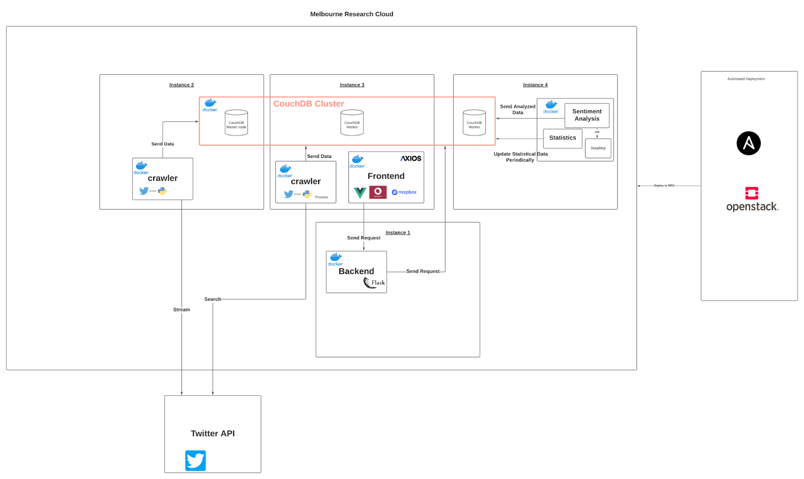
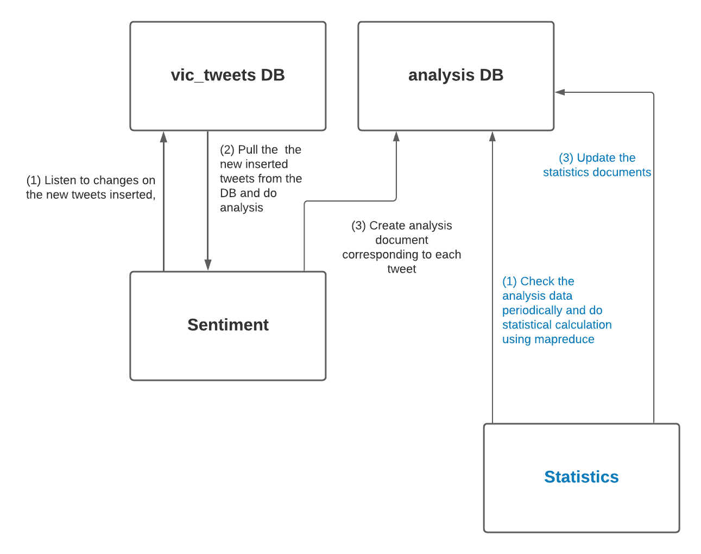
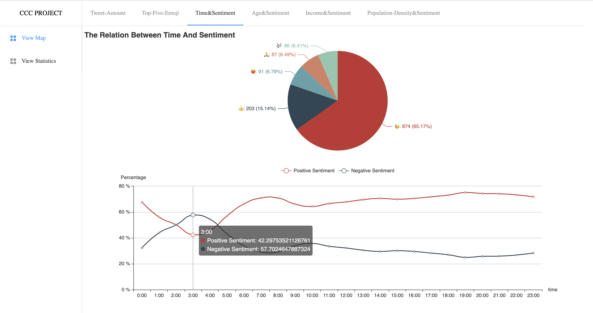
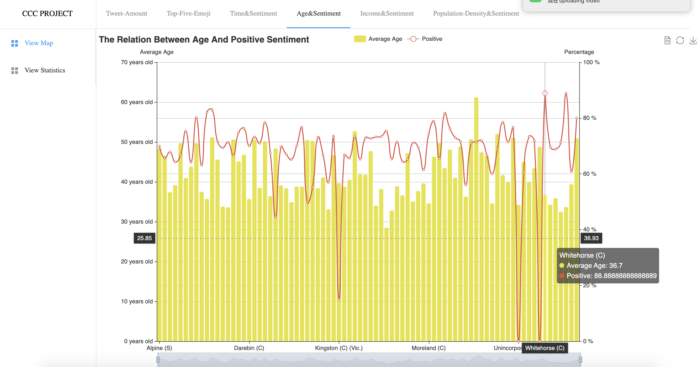
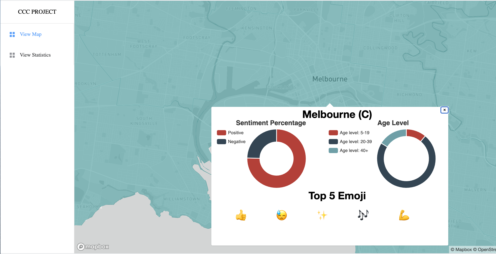
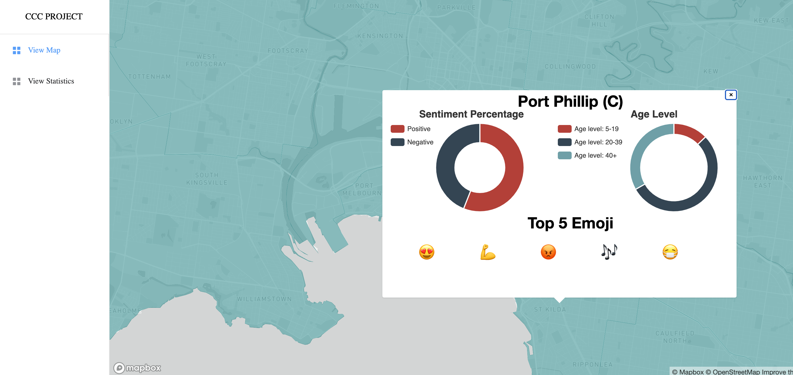

# VIC Tweet Analyzer project
Our project implements a system that provides insights into citizen's emotions across Victoria using the Twitter data and datasets provided by Aurin, to discover correlations between people's mood and age, as well as the area, population density, income level, and periods during a day. 

## System Architecture and Design

### Tweet Crawler 

The crawler is a python program that takes command-line arguments, to either search or stream the tweet data around an area into the database. As displayed in the architecture, the crawler is able to deploy and run in multiple instances at the same time. In the current system, the crawler is deployed and running on two instances at the same time, one is using the search method to collect data and the other one is using the stream method. What enables this is that before storing tweet data, the collector always checks if the tweet already existed in the database by tweet_id, which is a unique id allocated to each tweet by Twitter. In this way, the crawler can be scaled up/down based on available resources without getting document insertion conflicts/redundancy issues. 

### Tweet Analyzer

The motivation for the system is to detect the emotion and discover correlations between emotion and people’s age, as well as the area, population density, income level, and periods during a day. Since the sentiment analysis for positive and negative is quite limited, we also detect the emotion by deep learning approach, DeepMoji.

The data analyzer consistently listens to the changes made to vic_tweets. By using the filter function defined in the design document of the database, it only focuses on the new tweet insertion change. Then, it will pull the new data from the database, do analysis on them and create corresponding analysis documents in the analysis. Meanwhile, the statistics program is an individual component, doing statistical calculations using MapReduce functions and updates the statistics documents periodically (default set to every 500 seconds). 
In this way, the whole system is loosely coupled. The crawler, analyzer, and statistics update programs are completely isolated from each other, which makes the whole system more flexible, as well as increases the reliability of the system, as the failure of one component, does not affect the others. 

## Final product 

The project was deployed in the Melbourne Research Cloud for a limited time. Here are some of the screenshots displaying its interface/functionalities:

